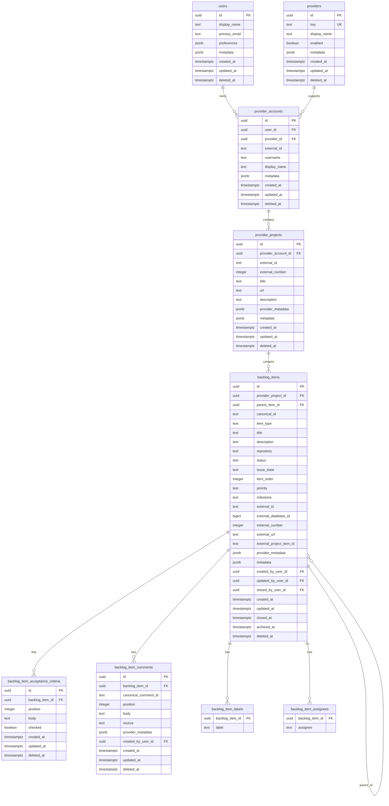

# Canonical Backlog Domain Model ERD

**Project:** Johnny-Johnny Agent  
**Story:** design-canonical-backlog-persistence  
**Status:** Draft  
**Purpose:** Define the canonical relational model for PostgreSQL-backed backlog persistence while preserving `backlog.yml` as an import/export format.

---

## Design Intent

Johnny-Johnny is moving from `backlog.yml` as the primary runtime persistence mechanism to PostgreSQL as the canonical system of record.

`backlog.yml` remains an adapter-level exchange format:

- import existing backlog state into PostgreSQL
- export canonical backlog state for review, portability, or source control
- support human-readable snapshots

The runtime domain should not depend on YAML.

---

## Core Domain Hierarchy

The canonical backlog root is the provider project/backlog itself.

For GitHub today, that is a GitHub Project such as:

```text
github / ggortsema / MycroftAI Engineering Roadmap
```

For Jira later, it may be:

```text
jira / <account> / MycroftAI Engineering Roadmap
```

The provider project is what Johnny-Johnny connects to in order to populate canonical backlog records.

```text
User
  └── ProviderAccount
        └── ProviderProject
              └── BacklogItem
                    ├── AcceptanceCriterion
                    ├── Comment
                    ├── Label
                    └── Assignee
```

Supporting root:

```text
Provider
  └── ProviderAccount
```

Canonical lookup path:

```text
provider / provider_account / provider_project
```

Example:

```text
github / ggortsema / MycroftAI Engineering Roadmap
```

---

## Mermaid ERD



---

## Entity Notes

### users

Represents a Johnny-Johnny user, not a GitHub/Jira/Linear identity.

A user may have multiple provider accounts, including multiple accounts for the same provider.

User-level preferences support future AI/chat workflows, notifications, and personalization.

---

### providers

Represents an external integration provider.

Initial provider:

```text
github
```

Future providers may include:

```text
jira
linear
gitlab
local
```

Provider-specific implementation details should live in adapters, not the canonical backlog domain.

---

### provider_accounts

Represents an external identity, account, workspace, or organization inside a provider.

For GitHub, the first account is:

```text
provider = github
username = ggortsema
```

A Johnny-Johnny user can have more than one GitHub account, so this is separate from `users`.

---

### provider_projects

Represents the provider-level project/backlog Johnny-Johnny connects to.

For the current backlog, this is:

```text
GitHub Project: MycroftAI Engineering Roadmap
```

The provider project is the root of the canonical backlog records in this first PostgreSQL model.

It is intentionally not modeled as a GitHub repository because the current backlog spans multiple repositories. Repository remains a field on each backlog item.

---

### backlog_items

Represents canonical backlog work items.

Epics and issues are stored in one table because they share most fields and differ primarily by type and hierarchy.

Hierarchy is represented by:

```text
parent_item_id
```

Current interpretation:

```text
Epic  = item_type = epic, parent_item_id = null
Issue = item_type = issue, parent_item_id points to an epic
```

Ordering is canonical domain data:

```text
item_order
```

Items are ordered among siblings within the same provider project and parent scope.

`priority` is separate from order:

```text
order    = where the item appears
priority = how important the item is
```

Provider-specific item details are temporarily stored both as selected nullable first-class fields and as `provider_metadata` JSONB for lossless import/export.

---

### backlog_item_acceptance_criteria

Represents ordered acceptance criteria attached to a backlog item.

The current YAML format stores acceptance criteria as strings. The database adds a nullable-friendly shape with:

```text
body
checked
position
```

For current imports, `checked` defaults to `false`.

---

### backlog_item_comments

Represents ordered comments attached to backlog items.

The current YAML format includes:

```text
id
body
source
created_at
provider_metadata
```

The database preserves those fields and adds nullable lifecycle/user fields for future auditability.

---

### backlog_item_labels and backlog_item_assignees

Labels and assignees are modeled as child tables to preserve list semantics without forcing these simple values into JSON.

---

## Future Extension Points

The following concepts are intentionally not first-implementation tables unless needed by the current story:

```text
provider_item_projections
sync_runs
sync_events
audit_events
webhook_events
chat_operations
backlog_imports
backlog_exports
```

They can attach naturally to:

```text
users
provider_accounts
provider_projects
backlog_items
```

---

## Naming Decision

The model uses `provider_projects`, not `backlogs`, because the provider project is the concrete external object Johnny-Johnny connects to for population and synchronization.

The provider project is still the backlog from Johnny-Johnny's perspective.

This avoids incorrectly modeling the backlog as a GitHub repository while still preserving the provider/project lookup path.

---

## YAML Boundary

YAML is not part of the domain model.

YAML is an adapter:

```text
backlog.yml -> import adapter -> PostgreSQL
PostgreSQL -> export adapter -> backlog.yml
```

Normal runtime mutations should eventually use PostgreSQL directly.
